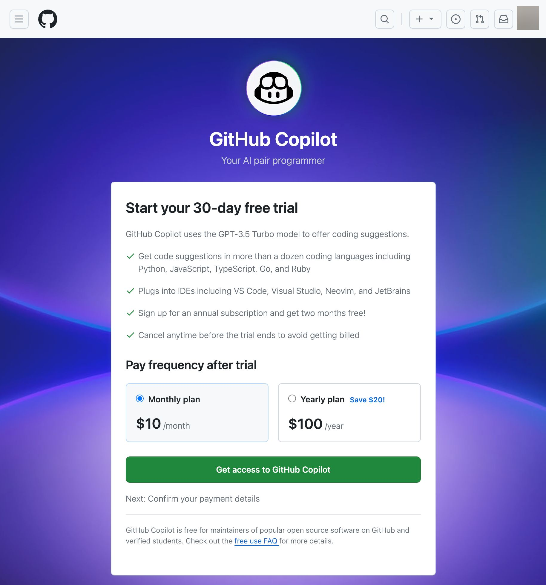
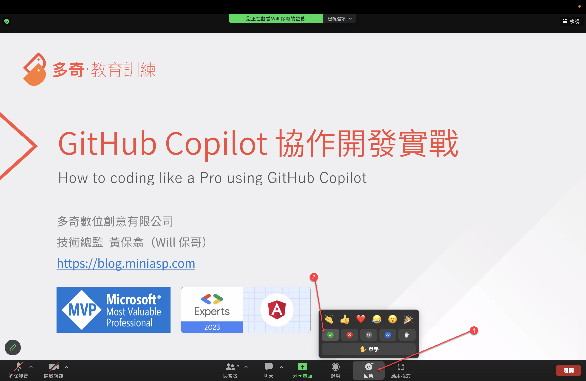

# GitHub Copilot 協作開發實戰 - 學員課前注意事項

## 課程簡介

我公司有位聰明的同事，已經使用了 GitHub Copilot 好幾個月，我問他覺得怎樣？他說很棒！有一次我坐在他的位置旁邊，跟他一起 Pair programming 了 10 分鐘，我發現他的「很棒」就只會用非常基礎的 GitHub Copilot 功能而已，根本沒有掌握 GitHub Copilot 的精髓之處，也不知道怎樣下 Prompt 來完成各種驚世駭俗的任務，這實在是太可惜了！🔥

我認為學習 GitHub Copilot 的最佳途徑，就是觀摩一個熟練的高手用 GitHub Copilot 寫 Code 給你看，帶你跳出思維的框框，不但學會 GitHub Copilot 的背後原理，更要知道 GitHub Copilot 的極限在哪裡，用正確的方法來使用 GitHub Copilot 才能釋放 AI 的最大潛力！✊

這是一堂含金量非常高的課，是專門針對「開發人員」所設計的，用滿滿的 2 小時，帶你快速上手 GitHub Copilot 所有可能的使用案例，帶你進入一個真正擁有 AI 開發助手的世界！👍

## 課程特色

* 由 [Will 保哥](https://www.facebook.com/will.fans) 全程線上授課，無地域限制，可即時回應學員任何疑惑
* 學員可透過多種管道提問：Zoom 聊天室、Zoom 共享桌面
* 學員可透過共享螢幕的方式提問與遠端控制，學員可觀摩解決問題的過程
* 課程全程錄影，學員課後 3 個月內可免費無限次重播！

## 報名連結

* 2023.12.01 (五) 20:00 - 22:00 [GitHub Copilot 協作開發實戰 (第一梯次)](https://www.accupass.com/go/gh-copilot) (已額滿)
* 2023.12.08 (五) 20:00 - 22:00 [GitHub Copilot 協作開發實戰 (第二梯次)](https://www.accupass.com/go/gh-copilot-2) (已額滿)

## 給學員的話

各位同學大家好：

這是一個幾乎整場都在 Live Demo 的互動課程，我將會使用 [Visual Studio Code](https://code.visualstudio.com/) 與 [GitHub Copilot](https://github.com/features/copilot) 示範如何真正發揮 AI 的最大潛力，讓 AI 成為你的開發助手，幫你完成各種驚世駭俗的開發任務！🔥

也許這堂兩小時的課程不會有太多的練習時間，但是你依然可以先準備好上課所需的開發環境，隨時體驗 GitHub Copilot 帶來的強大功能，並且在課堂上隨時提出你的任何想法與疑問。

以下文件將說明學員上課前的注意事項，請詳細閱讀並提前準備，有任何疑問都歡迎隨時[來信](mailto:training@miniasp.com)洽詢。

## 註冊 GitHub 帳號

如果你還沒有 GitHub 帳號，請務必先註冊好一個 GitHub 帳號，並且在上課前先登入 GitHub 帳號。

註冊網址：<https://github.com/signup>

## 購買 GitHub Copilot 訂閱方案

由於 GitHub Copilot 是個付費的訂閱服務，因此需要先購買 GitHub Copilot 訂閱方案，才能使用 GitHub Copilot 功能。

購買網址：<https://copilot.github.com/>

點擊 [Buy now](https://github.com/settings/copilot) 按鈕

然後選擇你要購買的方案，目前有兩種方案可供選擇：

1. 月繳 `$10` 美元
2. 年繳 `$100` 美元 (一年可以省下 `$20` 美元)

## 安裝 GitHub 支援的開發工具

目前 GitHub Copilot 支援以下四種開發工具：

1. [Visual Studio Code](https://code.visualstudio.com/)
   1. [GitHub Copilot](https://marketplace.visualstudio.com/items?itemName=GitHub.copilot)
   2. [GitHub Copilot Chat](https://marketplace.visualstudio.com/items?itemName=GitHub.copilot-chat)
2. [Visual Studio 2022](https://visualstudio.microsoft.com/zh-hant/vs/)
   1. [GitHub Copilot](https://marketplace.visualstudio.com/items?itemName=GitHub.copilotvs)
   2. [GitHub Copilot Chat](https://marketplace.visualstudio.com/items?itemName=VisualStudioExptTeam.VSGitHubCopilot)
3. [JetBrains IDEs](https://www.jetbrains.com/)
   1. [GitHub Copilot](https://plugins.jetbrains.com/plugin/17718-github-copilot)
4. [Neovim](https://neovim.io/)
   1. [Copilot.vim](https://github.com/github/copilot.vim)

目前為止 GitHub Copilot 支援度最高的開發工具是 [Visual Studio Code](https://code.visualstudio.com/)，支援了 GitHub Copilot 的完整功能，比較能發揮全部戰力，因此本課程主要會以 Visual Studio Code 為主要使用工具。不過，本次課程所提到的任何觀念與技巧，可以適用在任何一套支援 GitHub Copilot 的開發工具上。

## 安裝 Visual Studio Code 擴充套件

Visual Studio Code 是一套跨平台的編輯器，支援 Windows、macOS 與 Linux，因此理論上所有人都可以順利安裝與使用，如果你真的有遇到什麼困難，歡迎隨時[來信](mailto:training@miniasp.com)告知。

由於 Visual Studio Code 是一套輕量級的編輯器，它的功能是透過安裝「擴充套件」來增強的。

首先，Visual Studio Code 支援完整的「繁體中文」介面，而且翻譯品質非常好，在首次安裝並啟動 Visual Studio Code 後，該軟體就會提醒你安裝繁體中文套件，建議英文不太好的朋友可以安裝繁體中文版。

如果你的介面沒有自動切換到繁體中文版，那就請透過以下步驟手動切換：

GitHub Copilot 的功能也是透過安裝擴充套件來實現的，你需要安裝以下擴充套件才能順利的使用 GitHub Copilot 工具：

1. [GitHub Copilot](https://marketplace.visualstudio.com/items?itemName=GitHub.copilot)

    

2. [GitHub Copilot Chat](https://marketplace.visualstudio.com/items?itemName=GitHub.copilot-chat)

    

3. [VS Code Speech](https://marketplace.visualstudio.com/items?itemName=ms-vscode.vscode-speech)

    

另外還有兩個擴充套件是可選的，我覺得沒那麼實用，課堂上也不會解說，但有興趣你還是可以安裝來玩看看：

1. [GitHub Copilot Labs](https://marketplace.visualstudio.com/items?itemName=GitHub.copilot-labs)

    

    大部分功能都可以被 [GitHub Copilot Chat](https://marketplace.visualstudio.com/items?itemName=GitHub.copilot-chat) 取代，少部分功能很容易出現 Bug，因此我不太建議使用。

2. [GitHub Copilot Voice](https://marketplace.visualstudio.com/items?itemName=GitHub.heygithub) ([需等候開通才能使用](https://githubnext.com/projects/copilot-voice/))

    

    支援超過 300 個「英文」語音命令，使用時環境不能有太多噪音，英文好一點的人可以試試看。

## 上課前的注意事項

由於我們上課時會採用 [Zoom](https://zoom.us/zh-tw/download) 軟體進行授課，因此請學員在上課前先安裝好 [Zoom](https://zoom.us/zh-tw/download) 軟體的最新版，並且測試好麥克風與喇叭是否可以正常運作，以免上課時無法順利聽到課程內容。

以下幾點請在上課前確認完畢：

1. 檢查 Zoom 是否為最新版本

    我這邊目前最新的 Zoom 版本為 `5.16.10` (26186)

    

2. 檢查 Zoom 麥克風與喇叭是否正常運作

    你可以透過 Zoom 的測試功能來檢查麥克風與喇叭是否正常運作，如果你的麥克風與喇叭都正常運作，你會看到以下畫面：

    

## 上課時的注意事項

1. 你可以在課程開始前 30 分鐘進入 Zoom 會議室，以下是進入會議室的步驟

    開啟 Zoom 軟體，點擊「加入會議」

    

    輸入我們課前通知的「會議號碼」與「顯示名稱」

    

    輸入會議密碼

    

    測試喇叭和麥克風

    

    請務必測試一下麥克風與喇叭是否正常運作，以免上課時無法順利聽到課程內容。

    

    進入會議室之後，如果聽的到聲音，就按下「回應」的 ✅ 按鈕。

2. 多利用「回應」功能給予課程回饋

    過往有許多同學都找不到 Zoom 的「回應」功能，我特別截圖跟大家說明怎樣操作。

    

    基本上在 Zoom 最下方的工具列上，會有個「回應」的按鈕，按下去之後會有三排的表情符號可以按：

    第一排：這些表情符號按下之後可以表達你在課堂上的心情，而且 10 秒之後就會自動消失。這些表情非常重要，因為這可以讓講師知道你當下的心情，感覺開心的時候可以選 😂 (大笑)，聽到很厲害的內容時可以按下 👍 (讚)、❤ (愛心)、👏 (拍手)、🎉 (獻花) 等表情，這可以讓課程變的相當活絡有趣！

    第二排：這些符號按下去之後就不會自動消失，主要用來回應講師的提問，方便大家回答問題。例如講師問「大家都聽的到我的聲音嗎？」，你可以按下 ✅ (打勾) 來回答「聽的到」，或是按下 ❌ (叉叉) 來回答「聽不到」，這樣講師就可以知道你的聲音是否正常。

    第三排：只有一顆「舉手」的按鈕，按下去代表你想要開麥克風發言，講師會看到你的舉手，然後依序讓你發言。先按「舉手」的人會排在最上面，講師會更容易看到你的舉手狀態。

3. 利用【聊天室】來向講師或學員傳達訊息

    Zoom 軟體有個「聊天」功能，但請不要在「所有人」的視窗聊天，因為很多人一起聊天的結果，就是大家都找不到訊息。

    這個「聊天室」功能主要用來讓學員與講師之間的溝通，如果你有任何問題，可以在「聊天室」中發問，講師、助教或其他學員都會盡量回答你的問題。

    留言時，請務必在一個訊息中把問題打完，不要像 LINE 一樣，想到一句打一句，否則可能會不同人發問的問題之間交錯出現，導致閱讀困難。

4. 利用【麥克風】使用語音提問

    進入會議室之後，麥克風會處於「鎖定」的狀態，如有問題想透過語音發問，請先點擊 Zoom 軟體的「舉手」按鈕，講師會開啟你的麥克風讓你線上發問。

    如果講師需要學員進行語音互動時，願意發言的人，也可以先按下「舉手」等候講師呼喚，並準備開啟麥克風，這樣才不會花太多時間等待學員回應。

5. 不開放【視訊】使用

    原則上我們上課不需要開啟視訊鏡頭，以確保大家的個人隱私。

6. 使用 [Slido](https://www.slido.com/) 來提問

    請多利用 [Slido](https://www.slido.com/) 來進行提問，我們的【上課通知】郵件會包含 Slido 的活動代碼。

    你只要進入 [Slido](https://www.slido.com/) 網站，並且輸入「活動代碼」就可以進入本次課程的提問介面。

    

    提問時可以「匿名」，也可以「具名」，你可以自行決定要如何提問。

    

    提問前，請先看看是否有其他同學已經問了類似的問題，如果有的話，可以直接按讚，因為講師會優先回答讚數較高的提問。

    

## 請注意查收【上課通知】信件

我們會在上課前一兩天發送「上課通知」信件給學員，信件內容包含：

1. 寄件者：`julie@miniasp.com` 或 `service@accupass.com`

2. 郵件主旨：`【上課通知】GitHub Copilot 協作開發實戰 1208`

3. 郵件內容：包含課前注意事項、進入 Zoom 會議室的「會議號碼」與「會議密碼」、進入會議室之後的「顯示名稱」、Slido 提問網站的「活動代碼」等資訊。

如果你沒有收到通知郵件，請立即[寫信](mailto:training@miniasp.com)與我們聯繫！🔥
